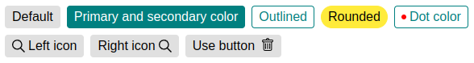

# vue3-simple-chip



Vue3 simple chip is a simple component for vue 3 written in typescript and without dependencies.

### Installation:

```
npm i -S vue3-simple-chip
```

### Props:

| Name                         | Description |        Type        | Required | Default |
|:-----------------------------|:-----------:|:------------------:|:--------:|:-------:|
| `label`                      |     Label on the chip.     |      `string`      |   false   |  `''`   |
| `primary-color`              |     The primary color is used for the background and border.     |      `string`      |   false   |  `#e0e0e0`   |
| `secondary-color`            |     The secondary color is used for the label.     |      `string`      |   false   |  `#000`   |
| `dot-color`                  |     A colored round dot is displayed if you pass the color. The sizes are 6 x 6 px.     | `string` or `null` |   false   |  `null`   |
| `outlined`                   |     Changes the primary and secondary colors in places.     |     `boolean`      |   false   |  `false`   |
| `rounded`                    |     Changes the border-radius from 8px to 20px.     |     `boolean`      |   false   |  `false`   |
| `use-button`                 |     If the value is `true`, the button is displayed.     |     `boolean`      |   false   |  `false`   |
| `button-click-callback-data` |     Any data that will be transferred to emit `on-button-click` after clicking on the button.     |       `any`        |   false   |  `undefined`   |

### Events:

| Name           |                                      Description                                       |
|:---------------|:--------------------------------------------------------------------------------------:|
| `on-button-click` | The event is triggered by clicking on the button and emits data from the props `buttonClickCallbackData`. Props `useButton` should be `true`. |

### Slots:

#### left-icon:
If a slot is used, it will display an icon to the left of the label.
```html
  <template #left-icon>
    
  </template>
```

#### right-icon:
If a slot is used, it will display an icon to the right of the label.
```html
  <template #right-icon>
    
  </template>
```

#### button-icon:
If a slot is used, it will be displayed instead of the default icon on the button.
```html
  <template #right-icon>
    
  </template>
```

### Example:
```jsx
  import Vue3SimpleChip from 'vue3-simple-chip.vue'
  ...
  components: {
    Vue3SimpleChip
  }
  ...
  <vue3-simple-chip
    label="foo"
    primary-color="teal"
    secondary-color="white"
  />
  ...
```

An example can be found in the [dev folder](https://github.com/Igor-Golovtsov/vue3-simple-chip/blob/main/dev/serve.vue) or you can run storybook.

### License
MIT License
